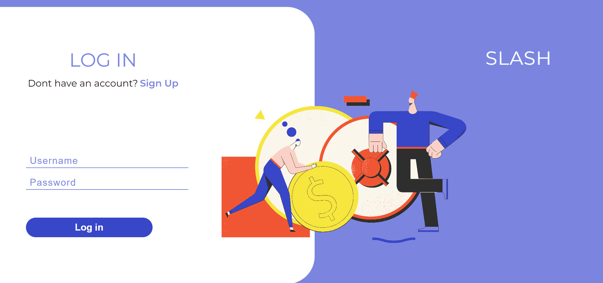
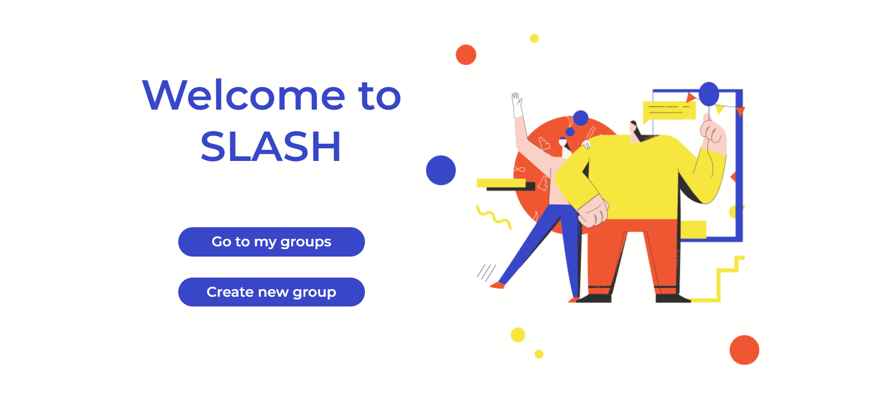
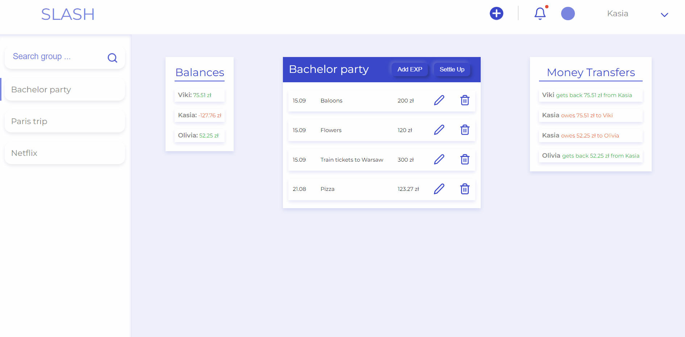
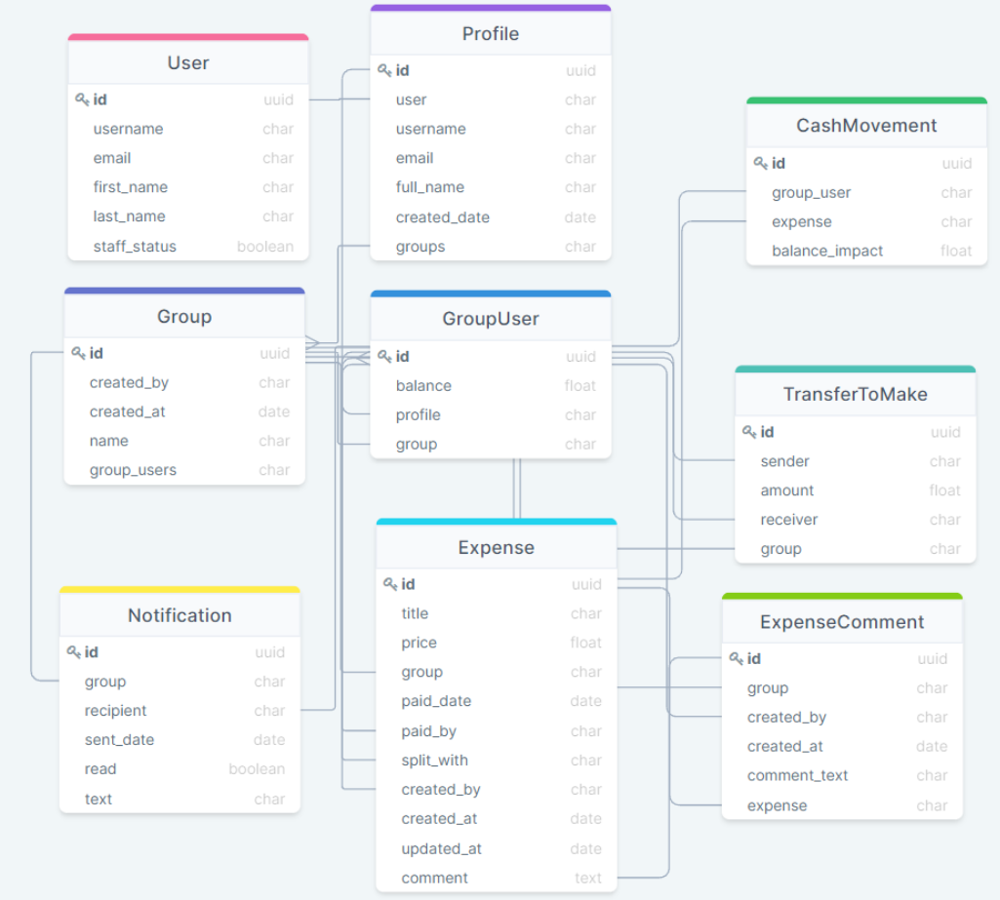

(🔴 Projekt jest w fazie rozwoju)

#Wstęp
SLASH jest aplikacją webową zbudowaną za pomocą Python frameworku Django. Głównym celem tej aplikacji jest śledzenie wydatków i zobowiązań finansowych pomiędzy użytkownikami grupy.

---
###Funkcjonalności:
- Rejestracja/Logowanie/Wylogowanie
- CRUD (create/read/update/delete) wydatków
- Śledzenie sald użytkowników
- Organizacja przelewów pieniężnych
- Tworzenie/usuwanie grup (`🔴 - niedostępne w tej wersji`)

###Logowanie/Rejestracja

### Tworzenie wydatku

### Edytowanie wydatku

###Rozliczenie
W celu rozliczenia swoich zaległości użytkownik ma możliwość użyć funkcji "settle-up". 
Po wcisnięciu przycisku "Settle-up" ładuje się Django formularz z wstępnie uzupełnionymi danymi na podstawie modelu "TransferToMake".

###Szczegóły frameworku Django
Ten projekt jest wykonany przy użyciu widoków opartych na klasach (Class based views) i dzieli się na dwie aplikacje: "users" i "groups".

**Aplikacja "users"** odpowiada za:

- Rejestracja/logowanie/wylogowywanie użytkowników
- Tworzenie/aktualizacja profilu
- `users/models.py` posiada model "Profile" (SQL tabela)

**Aplikacja "groups"** odpowiada za:

- CRUD (create/read/update/delete) wydatków
- Śledzenie sald użytkowników
- Organizacja przelewów pieniężnych
- Tworzenie/usuwanie grup (`🔴 - niedostępne w tej wersji`)
- `groups/models.py` posiada modele przedstawione na rys. 1 poniżej

##### rys. 1: baza dannych

---
## Przetwarzanie wydatków
Kiedy użytkownik dodaje, edytuje lub usuwa wydatek grupowy, wszystkie salda użytkowników tej grupy muszą się odświerzyć. Jest to osiągane przez model "CashMovement", który odpowiada za zmianę salda użytkownika po uwzględnieniu wydatku.

Wraz ze zmianami sald zmieniają się wartości do przelewów, które są obliczane na podstawie poniższej logiki:

1) Oblicz saldo każdego użytkownika i dodaj do biblioteki {'użytkownik': saldo}.
`saldo = wszystkie długi użytkownika w tej grupie - wszystkie pożyczki użytkownika w tej grupie`
2) Znajdź użytkownika z najwięukszym długiem i największą pożyczką w tej bibliotece (punkt 1).
3) Jeżeli wartość największego długu `<=` wartości największej pożyczki stwórz "TranserToMake" i usuń dłużnika z tej biblioteki, pomniejszając saldo pożyczkodawcy w bibliotece o wartość tego długu
4) Jeżeli wartość największego długu `>` wartości największej pożyczki stwórz "TranserToMake" i usuń pożyczkodawcę z tej biblioteki, pomniejszając saldo tego użytkownika w bibliotece o wartość tej pożyczki
5) Powtarzaj punkty 2-4 dopóki biblioteka (punk 1) nie będzie pusta
